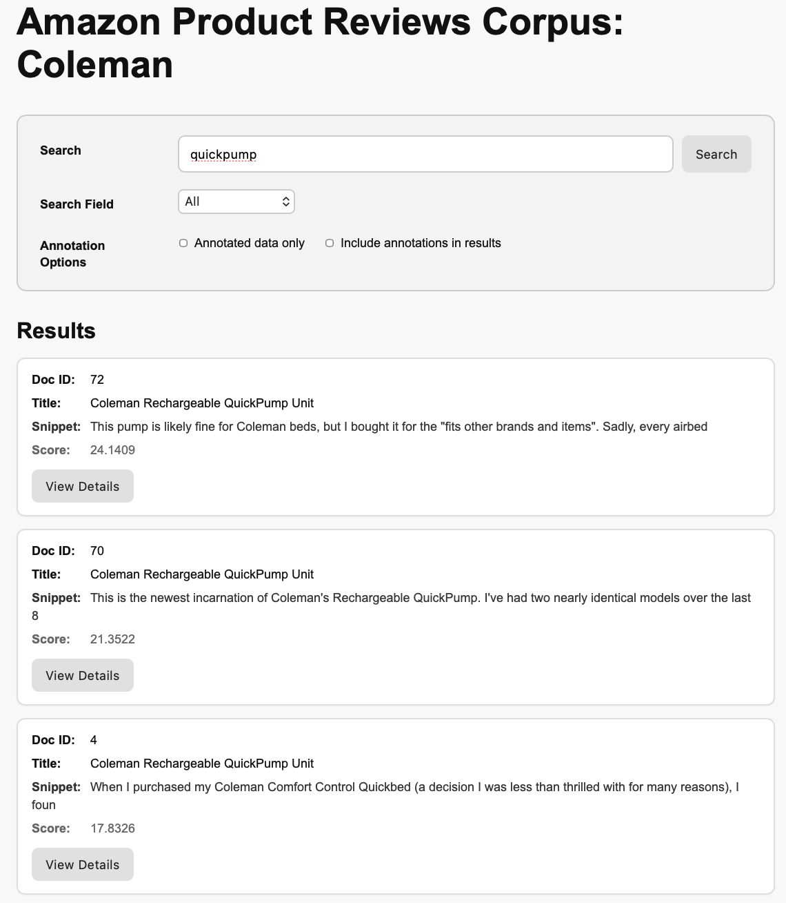
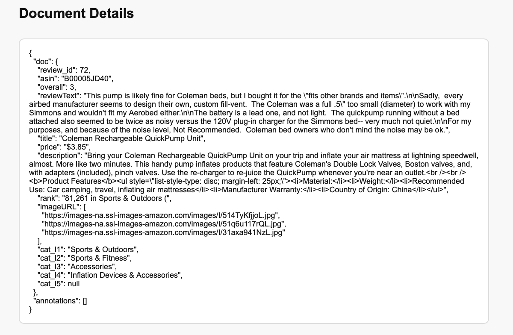
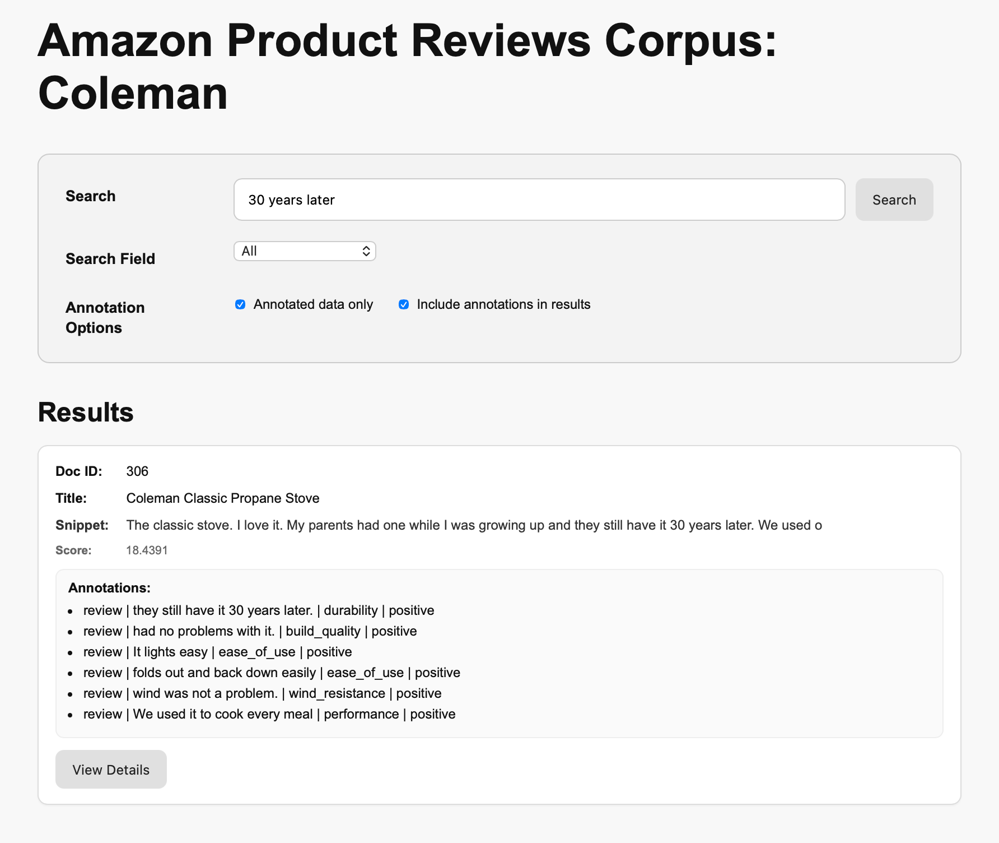
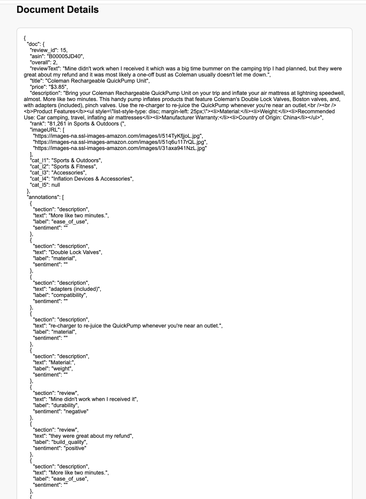

# UI Mockup

Below is a low-fidelity wireframe mockup for the single-page interface described in the plan.

The interface allows users to search the corpus and optionally inspect annotations from Sprint 3.

## 1. Search Interface

| Amazon Product Reviews Corpus: Coleman                                   |
|--------------------------------------------------------------------------|
| **Search Query** [\_\_\_\_\_\_\_\_\_\_\_\_\_\_\_\_\_\_\_\_] **[Search]** |
| **Search Field** (All ▼)                                                 |
| **Options**: All / Title / Description / ReviewText                      |
| **Annotation Options**                                                   |
| ☐ Annotated data only  ☐ Include annotations in results                  |

## 2. Controls

### 2.1 Search Query

Free text query entered by the user.

### 2.2 Search Field

Determines which field the search will be applied to.

**Options:**

-   All
-   Title
-   Description
-   ReviewText

### 2.3 Annotation Options

Two optional filters control how annotations are used in the results.

**Annotated data only**\
When enabled, results are restricted to documents that appear in the Sprint 3 adjudicated annotation files.

**Include annotations in results**\
When enabled, a compact summary of attribute annotations will be shown for each result.

## 3. Search Results (Default Mode)

When annotation options are disabled, the interface behaves like a standard corpus search tool.

``` text
Results
----------------------------------------------------------
Doc ID: <review_id>

Title:
<title>

Snippet:
<short snippet extracted from the matched field>

Score:
<retrieval score>

[ View Details ]
----------------------------------------------------------
```

> Notes:

-   Results are ranked according to the backend retrieval model.
-   A short snippet is shown to give context for the match.
-   The **View Details** button opens a document detail page.

------------------------------------------------------------------------

## 4. Search Results (With Annotation Display)

If **Include annotations in results** is enabled, each result will also display a summary of attribute annotations.

``` text
Results
----------------------------------------------------------
Doc ID: <review_id>

Title:
<title>

Snippet:
<short snippet>

Score:
<retrieval score>

Annotations:

• description | span: <span_text> | label: <attribute>
• review      | span: <span_text> | label: <attribute> | sentiment: <polarity>

[ View Details ]
----------------------------------------------------------
```

Annotation format:

``` text
<section> | <text span> | <attribute label> | <sentiment>
```

Where:

-   section ∈ {title, description, review}
-   attribute label is the annotated product feature
-   sentiment is present only for review annotations

------------------------------------------------------------------------

## 5. Document Detail Page

Clicking View Details opens a document detail view.

This page shows:

-   the full document content
-   the full annotation list (if available)

``` json
{
  "doc": {
    "review_id": "...",
    "title": "...",
    "description": "...",
    "reviewText": "..."
  },
  "annotations": [
    {
      "section": "review",
      "text": "...",
      "label": "durability",
      "sentiment": "negative"
    }
  ]
}
```

This page is primarily intended for:

-   inspecting the original document content
-   verifying annotation spans
-   examining the full annotation structure

------------------------------------------------------------------------

## 6. Interface Mockup Examples

The following screenshots illustrate different interface states.

## Search results without annotations



## Document detail page without annotations



## Search results with annotations enabled



## Document detail page with annotations



------------------------------------------------------------------------

## 7. Notes

-   The interface supports interactive corpus exploration.
-   **Annotated data only** filters results to documents that appear in the Sprint 3 adjudicated annotation outputs.
-   **Include annotations in results** adds a compact annotation summary under each search result.
-   The document detail page provides access to the complete document JSON and annotation structure.
